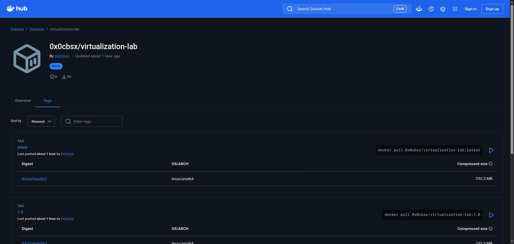
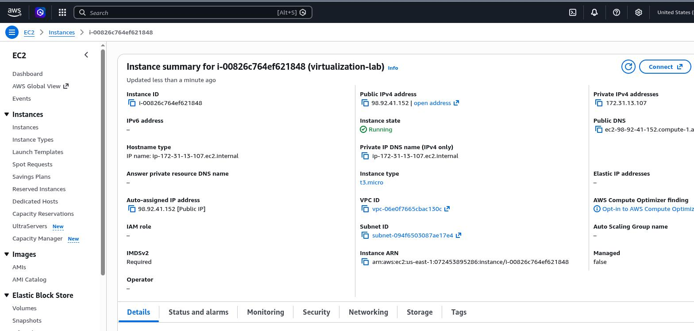
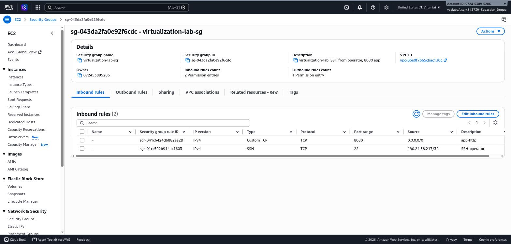
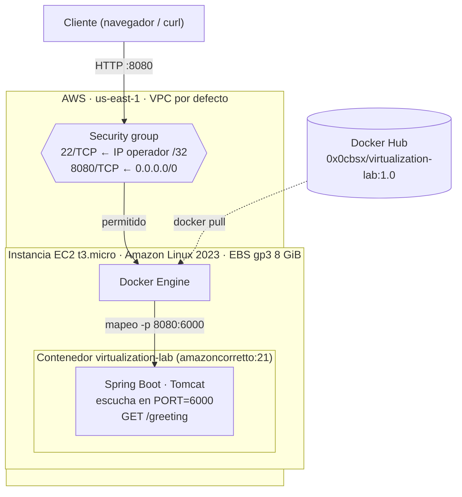
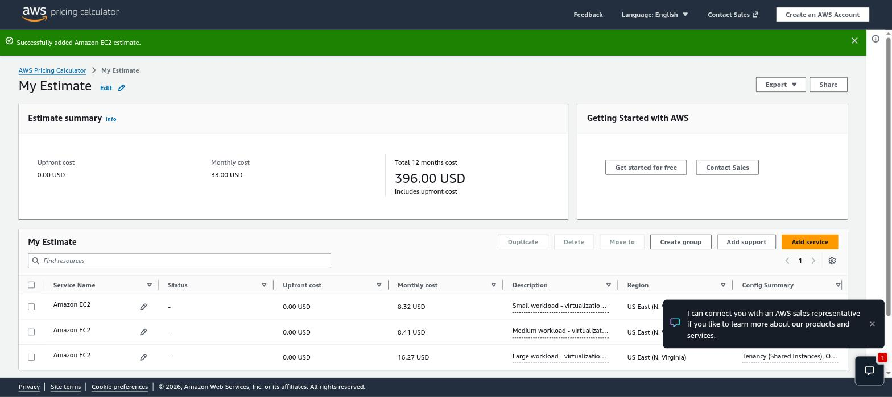

# Contenerización y despliegue de una aplicación web Java

Workshop de virtualización: se construye una pequeña aplicación web con Spring Boot, se empaqueta como imagen Docker, se ejecuta en contenedores aislados en local, se publica en Docker Hub y se despliega en una instancia EC2 de AWS.

## Stack tecnológico

- Java 21 LTS
- Maven 3.9+
- Spring Boot 4.1.1
- Docker / Docker Compose v2
- Docker Hub
- Amazon Linux 2023 sobre AWS EC2
- Imagen oficial `amazoncorretto:21`

## Enlaces rápidos

| Entregable | Enlace |
|---|---|
| Repositorio Docker Hub | https://hub.docker.com/r/0x0cbsx/virtualization-lab |
| URL pública del despliegue (EC2) | http://ec2-98-92-41-152.compute-1.amazonaws.com:8080/greeting?name=AWS |
| Estimación AWS Pricing Calculator | https://calculator.aws/#/estimate?id=079d0f7b3b9793b84cf8e19e74e5eb81dbe9b486 |

> **Nota sobre el puerto.** El enunciado pide que el puerto por defecto sea **6000**, pero los fragmentos de código de ejemplo usan `9000`. Se siguió el requisito explícito: `6000` por defecto en el código, el `Dockerfile` y `compose.yaml`; los puertos del host (34000–34002, 8087, 8080) son los del enunciado. El puerto 6000 está en la lista de "puertos inseguros" de Chrome/Firefox (`ERR_UNSAFE_PORT`), por eso las pruebas directas contra `:6000` se hacen con `curl`; a través de Docker se accede por los puertos del host, que no tienen esa restricción.

## Estructura del repositorio

```
├── pom.xml
├── Dockerfile
├── compose.yaml
├── src/main/java/co/edu/escuelaing/virtualizationlab/
│   ├── RestServiceApplication.java   # punto de entrada, lee PORT del entorno
│   └── HelloRestController.java      # GET /greeting?name=
├── src/test/java/...                 # prueba unitaria del controlador
├── scripts/
│   ├── collect-compose-evidence.sh   # Parte 3: levanta web + MongoDB y guarda evidencia
│   └── ec2-deploy.sh                 # Parte 5: instala Docker y despliega en EC2
└── docs/evidence/                    # evidencia (capturas y logs) citada en este README
```

## Parte 1 — Aplicación web

Controlador REST con un único endpoint:

```java
@GetMapping("/greeting")
public String greeting(@RequestParam(value = "name", defaultValue = "World") String name) {
    return "Hello, " + name + "!";
}
```

El puerto se lee de la variable de entorno `PORT`, con `6000` como valor por defecto:

```java
application.setDefaultProperties(
        Map.of("server.port", System.getenv().getOrDefault("PORT", "6000")));
```

### Construcción y ejecución local

```bash
mvn clean package
java -jar target/virtualization-lab-1.0.0.jar
```

```
http://localhost:6000/greeting?name=Pedro
→ Hello, Pedro!
```

**Evidencia:** [`docs/evidence/part1-local-run.txt`](docs/evidence/part1-local-run.txt)

## Parte 2 — Imagen y contenedores Docker

`Dockerfile`:

```dockerfile
FROM amazoncorretto:21
WORKDIR /app
COPY target/*.jar app.jar
ENV PORT=6000
EXPOSE 6000
ENTRYPOINT ["java", "-jar", "app.jar"]
```

Build y ejecución:

```bash
docker build -t 0x0cbsx/virtualization-lab:1.0 .
docker run -d --name virtualization-lab-1 -e PORT=6000 -p 34000:6000 0x0cbsx/virtualization-lab:1.0
```

### Aislamiento entre contenedores

Se levantaron tres contenedores de la misma imagen, cada uno mapeado a un puerto distinto del host, y cada uno respondió de forma independiente:

```
docker run -d --name virtualization-lab-2 -p 34001:6000 0x0cbsx/virtualization-lab:1.0
docker run -d --name virtualization-lab-3 -p 34002:6000 0x0cbsx/virtualization-lab:1.0

curl http://localhost:34000/greeting?name=Container1 → Hello, Container1!
curl http://localhost:34001/greeting?name=Container2 → Hello, Container2!
curl http://localhost:34002/greeting?name=Container3 → Hello, Container3!
```

**Evidencia:** [`docs/evidence/part2-isolation.txt`](docs/evidence/part2-isolation.txt) (salida real de `docker images`, `docker ps` y las tres peticiones `curl`).

## Parte 3 — Entorno multi-contenedor con Docker Compose

La aplicación web y MongoDB corren en contenedores separados sobre la misma red de Compose. La aplicación todavía no persiste datos en MongoDB; el servicio `db` sirve para demostrar cómo Compose gestiona varios servicios, la red interna, los mapeos de puertos y los volúmenes persistentes.

`compose.yaml`:

```yaml
services:
  web:
    build:
      context: .
      dockerfile: Dockerfile
    container_name: virtualization-web
    environment:
      PORT: 6000
      SPRING_DATA_MONGODB_URI: mongodb://db:27017/workshop
    ports:
      - "8087:6000"
    depends_on:
      - db

  db:
    image: mongo:8.2   # MongoDB 8; 8.2 is the line that runs on Linux kernels >= 6.19 (SERVER-121912)
    container_name: virtualization-db
    volumes:
      - mongodb:/data/db
      - mongodb_config:/data/configdb
    ports:
      - "27017:27017"
    command: mongod

volumes:
  mongodb:
  mongodb_config:
```

```bash
docker compose up -d --build        # construye la imagen web y levanta web + db
docker compose ps                   # ambos contenedores en estado "Up"
docker compose logs web
docker compose logs db
curl "http://localhost:8087/greeting?name=Compose"   # → Hello, Compose!

docker compose exec db mongosh
> show dbs
> use workshop
> db.messages.insertOne({ message: "Hello from Docker Compose" })
> db.messages.find()
> exit

docker compose down        # elimina contenedores, conserva los volúmenes
docker compose down -v     # elimina contenedores y los datos de MongoDB
```

- **Red:** Compose crea automáticamente la red `<proyecto>_default`; `web` resuelve a MongoDB por el nombre de servicio `db` (de ahí `mongodb://db:27017/workshop`).
- **Volúmenes:** `mongodb` y `mongodb_config` guardan los datos fuera del ciclo de vida del contenedor: sobreviven a `docker compose down` y solo se borran con `down -v`.
- **Imagen:** se usa MongoDB 8 en lugar de la obsoleta `mongo:3.6.1`. Se fijó la etiqueta `mongo:8.2` porque las builds actuales de `mongo:8` (8.0.x) se niegan a arrancar en kernels Linux ≥ 6.19 (`MongoDB cannot start: Linux kernel versions 6.19 and newer has a known incompatibility…`, [SERVER-121912](https://jira.mongodb.org/browse/SERVER-121912)); la máquina de desarrollo usa kernel 7.2. `mongo:8.2` pertenece a la misma versión mayor y sí incluye la corrección.

Para regenerar la evidencia de esta parte: `./scripts/collect-compose-evidence.sh`.

**Evidencia:** [`docs/evidence/part3-compose.txt`](docs/evidence/part3-compose.txt) (`docker compose ps` con ambos servicios, logs de `web` y `db`, respuesta del endpoint y sesión de `mongosh`).

## Parte 4 — Publicación en Docker Hub

Repositorio público: **https://hub.docker.com/r/0x0cbsx/virtualization-lab**

```bash
docker tag 0x0cbsx/virtualization-lab:1.0 0x0cbsx/virtualization-lab:latest
docker push 0x0cbsx/virtualization-lab:1.0
docker push 0x0cbsx/virtualization-lab:latest
```

Ambos tags (`1.0` y `latest`) quedaron publicados y son visibles sin autenticación (repositorio público).

**Evidencia:** [`docs/evidence/part4-dockerhub-push.txt`](docs/evidence/part4-dockerhub-push.txt) y captura [`docs/evidence/dockerhub-repository.jpg`](docs/evidence/dockerhub-repository.jpg).



## Parte 5 — Despliegue en AWS EC2

- **Instancia:** `i-00826c764ef621848` (`virtualization-lab`) — Amazon Linux 2023, `t3.micro`, región `us-east-1`, volumen raíz `gp3` de 8 GiB.
- **IP pública:** `98.92.41.152`
- **DNS público:** `ec2-98-92-41-152.compute-1.amazonaws.com`
- **Security group:** `virtualization-lab-sg` (`sg-043da2fa0e92f6cdc`)
- **Reglas de entrada:**
  - SSH (22/TCP) restringido a la IP pública del operador (`/32`).
  - TCP 8080 abierto a `0.0.0.0/0`: el servicio debe ser accesible por el evaluador desde cualquier red. En un escenario real se restringiría al rango de la red que necesite acceso (o se pondría detrás de un balanceador).
  - Ningún otro puerto expuesto (ni 6000 ni 27017).

### Pasos

La instancia, el par de llaves y el security group se crearon con AWS CLI desde CloudShell:

```bash
aws ec2 import-key-pair --key-name vlab-key --public-key-material fileb://vlab-key.pub
SG=$(aws ec2 create-security-group --group-name virtualization-lab-sg \
      --description "virtualization-lab: SSH from operator, 8080 app" --query GroupId --output text)
aws ec2 authorize-security-group-ingress --group-id $SG --ip-permissions \
  'IpProtocol=tcp,FromPort=22,ToPort=22,IpRanges=[{CidrIp=<IP-OPERADOR>/32}]' \
  'IpProtocol=tcp,FromPort=8080,ToPort=8080,IpRanges=[{CidrIp=0.0.0.0/0}]'
AMI=$(aws ssm get-parameter --name /aws/service/ami-amazon-linux-latest/al2023-ami-kernel-default-x86_64 \
      --query Parameter.Value --output text)
aws ec2 run-instances --image-id $AMI --instance-type t3.micro --key-name vlab-key \
  --security-group-ids $SG \
  --block-device-mappings 'DeviceName=/dev/xvda,Ebs={VolumeSize=8,VolumeType=gp3}' \
  --tag-specifications 'ResourceType=instance,Tags=[{Key=Name,Value=virtualization-lab}]'
```

Instalación de Docker y despliegue por SSH:

```bash
# desde la máquina local
scp -i vlab-key scripts/ec2-deploy.sh ec2-user@ec2-98-92-41-152.compute-1.amazonaws.com:~
ssh -i vlab-key ec2-user@ec2-98-92-41-152.compute-1.amazonaws.com

# dentro de la instancia
bash ec2-deploy.sh install      # yum update, instala y arranca Docker, agrega ec2-user al grupo docker
exit                            # reconectar para que tome el grupo docker
ssh -i vlab-key ec2-user@ec2-98-92-41-152.compute-1.amazonaws.com
bash ec2-deploy.sh run          # docker pull + docker run, y guarda evidencia en ~/part5-ec2.txt
```

`ec2-deploy.sh run` ejecuta exactamente:

```bash
docker pull 0x0cbsx/virtualization-lab:1.0
docker run -d --name virtualization-lab --restart unless-stopped \
  -e PORT=6000 -p 8080:6000 0x0cbsx/virtualization-lab:1.0
docker ps
docker logs virtualization-lab
```

### Verificación

**URL pública:** http://ec2-98-92-41-152.compute-1.amazonaws.com:8080/greeting?name=AWS → `Hello, AWS!`

```
$ docker ps
CONTAINER ID   IMAGE                            COMMAND               CREATED          STATUS          PORTS                                       NAMES
1037154c0b87   0x0cbsx/virtualization-lab:1.0   "java -jar app.jar"   11 seconds ago   Up 10 seconds   0.0.0.0:8080->6000/tcp, :::8080->6000/tcp   virtualization-lab

$ curl "http://ec2-98-92-41-152.compute-1.amazonaws.com:8080/greeting?name=AWS"     # desde fuera de AWS
Hello, AWS!
```

> La instancia corre dentro de un AWS Academy Learner Lab: al finalizar la sesión del laboratorio se detiene y, al reiniciarla, AWS le asigna otra IP/DNS pública. Si la URL no responde, la evidencia de abajo documenta el despliegue funcionando.

**Evidencia:**
- [`docs/evidence/aws-ec2-instance-running.jpg`](docs/evidence/aws-ec2-instance-running.jpg) — consola EC2 con la instancia en ejecución.
- [`docs/evidence/part5-ec2.txt`](docs/evidence/part5-ec2.txt) — salida completa: versión del SO, `docker pull`, `docker run`, `docker ps`, `docker logs`, `curl` interno y externo.
- [`docs/evidence/aws-ec2-browser.jpg`](docs/evidence/aws-ec2-browser.jpg) — navegador accediendo a la URL pública.
- [`docs/evidence/aws-security-group.jpg`](docs/evidence/aws-security-group.jpg) — reglas de entrada del security group.






La instancia se mantiene en ejecución para la evaluación; una vez calificado el taller se terminará (`aws ec2 terminate-instances`) para evitar cargos.

## Parte 6 — Modelo de despliegue y análisis de costos

### Arquitectura del despliegue



Vista simplificada (la del enunciado):

```
Cliente
  ↓ petición HTTP (:8080)
Security group
  ↓
Instancia virtual EC2
  ↓
Docker Engine  (-p 8080:6000)
  ↓
Contenedor de la aplicación web Java (Spring Boot, :6000)
```

| Capa | Responsabilidad |
|---|---|
| Instancia EC2 | Cómputo, memoria, almacenamiento y red aislados, facturados por hora/segundo. |
| Contenedor Docker | Entorno de ejecución portable que empaqueta la aplicación y su runtime (JRE 21). |
| Aplicación Java | Recibe peticiones HTTP y expone la lógica de negocio (`/greeting`). |
| Security group | Controla qué tráfico entrante puede llegar a la instancia. |

### Supuestos por escenario

| Supuesto | Pequeño | Mediano | Grande |
|---|---|---|---|
| Peticiones/mes | 10.000 | 100.000 | 1.000.000 |
| Región AWS | US East (N. Virginia) | US East (N. Virginia) | US East (N. Virginia) |
| Tipo de instancia | `t3.micro` (2 vCPU, 1 GiB) | `t3.micro` (2 vCPU, 1 GiB) | `t3.small` (2 vCPU, 2 GiB) |
| Número de instancias | 1 | 1 | 1 |
| Modelo de precio | On-Demand, Linux | On-Demand, Linux | On-Demand, Linux |
| Horas de ejecución/mes | 730 (24/7) | 730 (24/7) | 730 (24/7) |
| Almacenamiento EBS | 8 GiB `gp3` | 8 GiB `gp3` | 8 GiB `gp3` |
| Tamaño promedio de petición | ~0,5 KB (GET + cabeceras) | ~0,5 KB | ~0,5 KB |
| Tamaño promedio de respuesta | ~0,5 KB (texto + cabeceras HTTP) | ~0,5 KB | ~0,5 KB |
| Transferencia saliente real | ~5 MB | ~50 MB | ~500 MB |
| Transferencia saliente usada en el cálculo | 1 GB | 2 GB | 5 GB |
| Horario | Continuo | Continuo | Continuo |
| Alta disponibilidad | No | No | No (ver discusión) |

Justificación:

- **Región:** `us-east-1` es la región donde se desplegó la instancia real y suele ser la más económica.
- **Instancia:** la respuesta de `/greeting` es trivial; el recurso que limita es la memoria de la JVM + Tomcat (~200–300 MB en reposo). Con 1.000.000 peticiones/mes el promedio es ~0,4 peticiones/s, pero se sube a `t3.small` para tener margen de RAM y créditos de CPU ante picos.
- **Horas:** el servicio se expone como una API pública disponible permanentemente, así que se factura el mes completo (730 h). Encenderlo solo en horario laboral (~220 h/mes) reduciría el cómputo aproximadamente a un 30 %.
- **Transferencia:** la transferencia *entrante* en AWS es gratuita; la *saliente* se redondeó hacia arriba intencionalmente para no subestimar el costo.
- **Alta disponibilidad:** ninguno de los escenarios la exige (es un laboratorio). Si el escenario grande la requiriera, harían falta ≥ 2 instancias en zonas de disponibilidad distintas + un Application Load Balancer, lo que aproximadamente triplicaría el costo mensual (el ALB por sí solo cuesta ~USD 16/mes).

### Estimación de costos (AWS Pricing Calculator)

Estimación pública generada con la calculadora oficial: **https://calculator.aws/#/estimate?id=079d0f7b3b9793b84cf8e19e74e5eb81dbe9b486**

**Evidencia:** [`docs/evidence/aws-pricing-calculator-estimate.jpg`](docs/evidence/aws-pricing-calculator-estimate.jpg)



| Escenario | Peticiones/mes | Costo mensual de infraestructura | Costo estimado por petición | Principales generadores de costo |
|---|---|---|---|---|
| Pequeño | 10.000 | USD 8,32 | USD 0,000832 | Horas de EC2 + almacenamiento EBS (la transferencia de datos es prácticamente nula) |
| Mediano | 100.000 | USD 8,41 | USD 0,0000841 | Horas de EC2 + almacenamiento; la transferencia sigue siendo marginal |
| Grande | 1.000.000 | USD 16,27 | USD 0,00001627 | Instancia más grande (`t3.small`) para tener margen de CPU/RAM; transferencia de datos empieza a ser perceptible |

Costo por petición = costo mensual de infraestructura ÷ peticiones del mes.

### Discusión arquitectónica

**¿Por qué un despliegue basado en EC2 tiene un costo base mensual aunque reciba pocas peticiones?**
Porque se paga por el *cómputo reservado* (la instancia encendida) y por el *almacenamiento aprovisionado* (el volumen EBS), no por petición atendida. Una instancia `t3.micro` cuesta lo mismo esté recibiendo 10 o 10.000 peticiones ese mes, porque AWS factura por tiempo de actividad de la VM, no por uso real de CPU.

**¿En qué nivel de carga el costo fijo deja de ser relevante por petición?**
A partir de decenas de miles de peticiones/mes el costo por petición ya cae a fracciones de centavo, y en el escenario grande (1.000.000) el costo por petición es casi 100 veces menor que en el pequeño. El costo fijo "se diluye" mientras el tráfico crece; a partir de cierto punto, sin embargo, empieza a dominar de nuevo el tamaño de la instancia y la transferencia de datos, no el costo base.

**¿Qué obligaría a pasar de una instancia EC2 a varias?**
Que una sola instancia no pueda sostener la concurrencia o la latencia requerida (CPU/RAM agotados, cola de conexiones saturada), que se necesite tolerancia a fallos (si la instancia única se cae, el servicio completo cae) o que se necesite desplegar en múltiples zonas de disponibilidad/regiones para reducir latencia geográfica.

**¿Qué otros servicios necesitaría un despliegue en producción?**
Un balanceador de carga (Application Load Balancer) frente a varias instancias en un Auto Scaling Group, una base de datos administrada (RDS) en vez de almacenamiento local, un registro de imágenes privado (Amazon ECR) en vez de Docker Hub público, monitoreo y alarmas (CloudWatch), backups automatizados y, probablemente, un WAF/CDN (CloudFront) delante del balanceador.

**¿Sería más económico un despliegue serverless para el escenario pequeño?**
Sí, muy probablemente. Con 10.000 peticiones al mes el tráfico es extremadamente bajo y esporádico: una función Lambda (facturada por invocación y milisegundos de ejecución, con una capa gratuita generosa) no tendría el costo fijo de una instancia encendida 24/7. La ventaja de EC2 aparece cuando la carga es sostenida y predecible (como en el escenario grande), donde pagar por tiempo de actividad termina siendo más barato que pagar por invocación; para tráfico bajo e irregular, pagar solo por lo que efectivamente se ejecuta (serverless) es más eficiente.

### Conclusión

Para los tres escenarios evaluados, el costo de infraestructura EC2 se mantiene entre 8 y 16 dólares al mes, dominado por el costo fijo de la instancia encendida y no por el volumen de tráfico. EC2 es una opción razonable y sencilla para el escenario grande (carga sostenida, donde el costo por petición ya es marginal), pero para el escenario pequeño un enfoque serverless probablemente sería más costo-eficiente al evitar pagar por una instancia inactiva la mayor parte del tiempo. Dado que este workshop es una prueba de concepto de virtualización y no un servicio productivo, EC2 con una sola instancia `t3.micro` es apropiado por su simplicidad operativa, aunque no sería la elección final para una carga real de producción sin agregar balanceo, escalado automático y alta disponibilidad.
